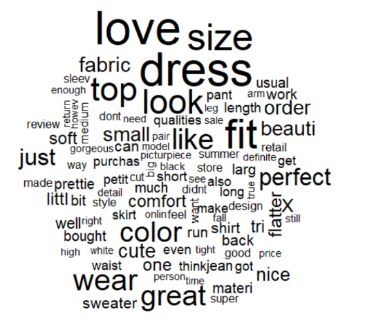

As customer needs grow more and more complex and nuanced, businesses require an ever deeper understanding of their customers in order to boost customer retention and brand loayalty. Anonymized product reviews provide a treasure grove of data for companies to use to better understand their customer markets. 

This spring, I worked with a group of fellow classmates from grad school to understand how businesses can break down text data to understand their customers.

> A link to the source code and methodology used in this project is available [here](https://github.com/Charlie-Mei/understanding-clothing-reviews).

We found a dataset on reviews of women's e-commerce clothing reviews on [Kaggle](https://www.kaggle.com/nicapotato/womens-ecommerce-clothing-reviews). The dataset provided text data on how each customer reviewed and rated their purchase, as well as a flag that indicated whether or not they recommended their product of purhcase.  The dataset was related to a specific, anonymized e-commerce retailer.

From this data, it was possible to understand:

- the overall sentiment for clothing items
- whether there was a relationship between specific words/sentiment on whether they end up recommending the product to others.

## Exploring the data

A wordcloud offers a quick exploratory way to understand the typical words used by reviewers of clothing products. It appears words such as "fit", "size" and "look" are among the top five words used. This result is interesting; thee words potentially reveal the main factors that customers are considering as they are considering whether or not to buy a certain clothing product.

We also assigned sentiment scores to the words used by reviewers. Our method of score allocation was based on the "Afinn" lexicon, as that method anks words used by customers on a scale of -5 to 5, where the higher the number indicates the more positive the sentiment. Based on this approach, it appears that customers tended to have, on average, a positive sentiment on the clothing products offered by this retailer.

## Do certain words indicate higher likelihood of recommendation?

After constructing a vocabulary of words, we proceeded to use a random forest model to understand whether the words used in customer reviews and/or their sentiment can reveal likelihood of recommendation.

Random forest models are particularly useful in extracting the top explanatory factors for a given outcome. In this case, whether or not the product was recommended was the target outcome, with the frequency count of words used by customers being the explanatory factors. As each decision tree is run, only a small random subset of words will be used to predict recommendation. After being repeated multiple times, the most important words are revealed as those that reduce the error in correctly classifying recommendaiton by the largest amounts.

A variable importance plot visualizes the results from this analysis. The numeric axis indicates by how much each word/sentiment reduces the error in predicting recommendatio. Based on this approach, we identified consumer sentiment as the key predictor for recommending the product. In terms of words, "class", "return", "age" and "perfect" were all top predictors of recommendation too.

## Putting together the results

The results from our analysis indicate that there is indeed value for businsses in using customer review data to understand their customers. While surveys and focus groups are traditional approaches, basic text analysis also offers a complementary tool to deriving new and potentially surprising strategies for reducing customer churn and increasing customer loyalty.